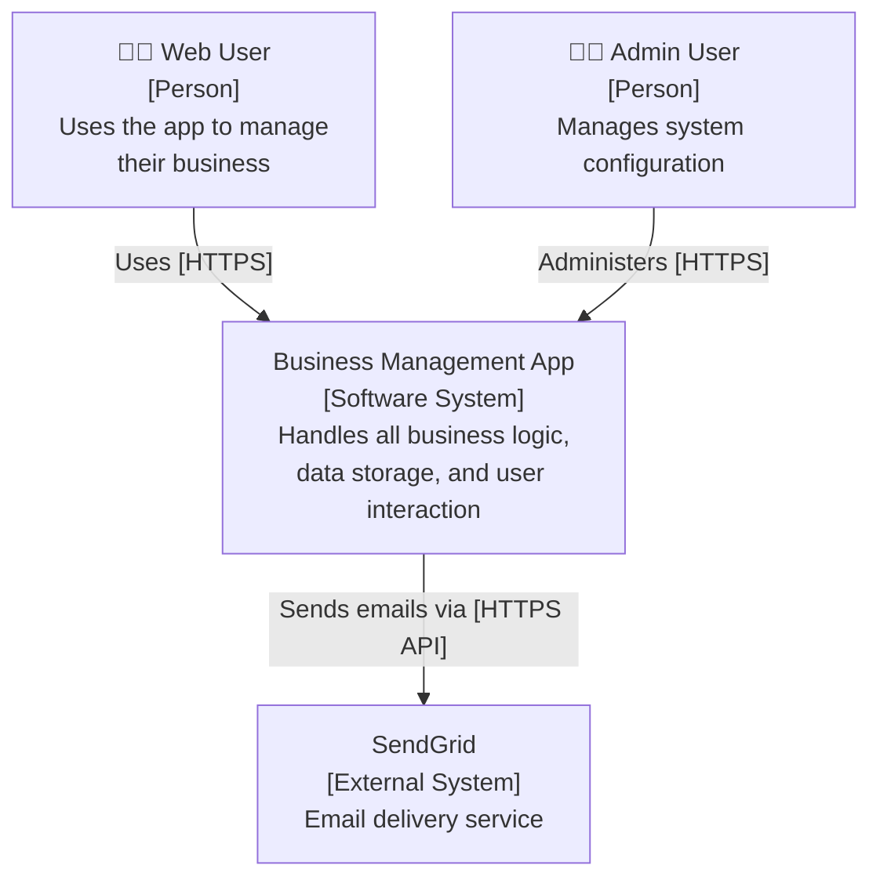
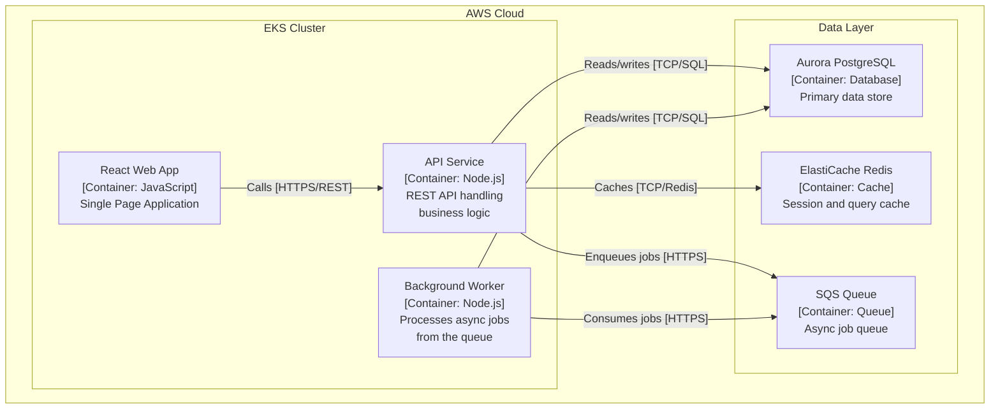
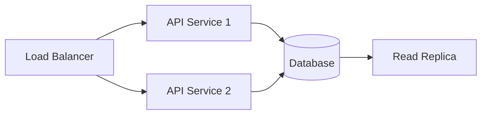
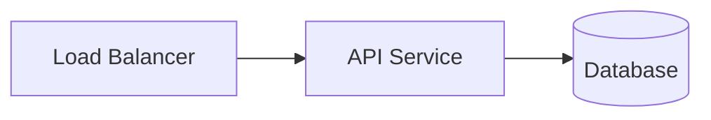

# Cloud & DevOps Engineering: Capstone Projects
## A Comprehensive Learning Book — Beginner to Advanced

---

> **Who this book is for:** Cloud and DevOps Engineering students who are ready to bring everything they've learned together into real, production-grade projects — and present that work professionally to the world.
>
> **What you will build:** Six enterprise-level projects, a personal brand, an open-source contribution record, and a portfolio that proves you can do the job.

---

# Table of Contents

1. [Introduction: Why Capstone Projects Matter](#introduction)
2. [Chapter 1: Project Documentation — Architecture Diagrams, ADRs, Runbooks, README Standards](#chapter-1)
3. [Chapter 2: Architecture Diagramming — C4 Model, draw.io, Excalidraw, Mermaid, Structurizr](#chapter-2)
4. [Chapter 3: Technical Writing — Blog Posts, Case Studies, Conference Talks](#chapter-3)
5. [Chapter 4: Demo Environments — Live Demos, Video Walkthroughs, Infrastructure Cost Management](#chapter-4)
6. [Chapter 5: Open Source Contribution — Finding Good First Issues, PRs, Community Engagement](#chapter-5)
7. [Chapter 6: Portfolio Site — GitHub Profile, Personal Site, Blog Platforms](#chapter-6)
8. [Final Chapter: How It All Connects — Your Real-World Workflow](#final-chapter)

---

# Introduction: Why Capstone Projects Matter {#introduction}

Imagine you are a hiring manager at a growing tech company. You have 200 CVs on your desk. Most of them list the same certifications, the same buzzwords, the same tools. Then one candidate sends a link to their GitHub. It has a complete EKS deployment with CI/CD, monitoring, tracing, security policies — all documented with clean READMEs, architecture diagrams, and a 2,000-word case study explaining every decision they made.

That candidate gets the interview. Often, they get the job.

This is the power of capstone projects.

A capstone project is not just practice work. It is evidence. It tells a potential employer, a client, or a collaborator: "I have done this. I understand it deeply enough to explain it, document it, and reflect on what I would do differently." In an industry where many people can claim skills, the ones who can *show* skills stand out completely.

## What This Book Covers

This book is the final stage of your Cloud and DevOps engineering education. You are not learning new isolated tools here. You are learning how to combine everything — infrastructure, automation, security, observability, containers, databases — into complete, professional-grade systems. Then you are learning how to document, communicate, and share that work in a way that builds your professional reputation.

By the end of this book, you will have:

- Six production-grade projects on your GitHub
- Architecture diagrams following the C4 model for each project
- Five published technical blog posts (minimum 1,000 words each)
- A 10-minute video walkthrough of your best project
- One meaningful pull request merged into an active open-source project
- A complete, professional portfolio site
- A technical review of your best project from a senior engineer

These are not small achievements. This is a portfolio that competes with engineers who have two to three years of industry experience.

## How to Use This Book

Each chapter covers one major topic area. Every chapter follows the same structure: plain-language explanation first, then real-world analogies, then technical depth, then a hands-on task. Do not skip the tasks. The tasks are where the learning becomes real.

Some chapters will feel more comfortable than others depending on your background. If you come from a writing background, the technical writing chapter will feel natural but the infrastructure projects will stretch you. If you come from a pure engineering background, the portfolio and communication chapters may feel uncomfortable. That discomfort is exactly where your growth is.

Read every chapter. Do every task. Ship every project.

Let's begin.

---

# Chapter 1: Project Documentation — Architecture Diagrams, ADRs, Runbooks, README Standards {#chapter-1}

## The Problem With Undocumented Projects

Here is a situation every engineer has faced: you inherit a system. Maybe it is a new job, maybe a colleague left, maybe it is your own project from six months ago. The code is there. The infrastructure is running. But there is no documentation. No one explained why the database is in a private subnet and the load balancer is public. No one wrote down what to do when the cache goes down. No one documented why the team chose Postgres over MySQL.

You are now in the dark. And in that darkness, you will make mistakes — relearning decisions that were already made, breaking things because you did not know they were connected, or spending hours reading code to answer a question that could have been answered in one paragraph.

Good documentation prevents all of this. And more importantly: good documentation is what separates junior engineers from senior ones. Juniors write code. Seniors write code *and* make sure others can understand and maintain it.

## The Four Pillars of Project Documentation

Think of your documentation system as a house. It has four walls, each serving a different purpose:

**Wall 1: The README** — This is your front door. It tells someone what your project is, why it exists, and how to get started in five minutes.

**Wall 2: Architecture Diagrams** — These are the blueprints. They show how the pieces fit together visually.

**Wall 3: Architecture Decision Records (ADRs)** — These are the meeting notes. They capture *why* decisions were made, not just what the decisions were.

**Wall 4: Runbooks** — These are the emergency procedures on the wall. When something breaks at 2am, the runbook tells the on-call engineer exactly what to do.

Without all four walls, the house falls down.

---

## Wall 1: README Standards

A README is the first thing anyone sees when they open your repository. It needs to answer five questions instantly:

1. What does this project do?
2. Who is it for?
3. How do I run it locally?
4. How is it deployed?
5. How do I contribute?

### The Anatomy of a Professional README

```markdown
# Project Name

> One sentence that explains what this project does and why it exists.

[](link)
[](LICENSE)

## Overview

Two to three paragraphs explaining the problem this solves, the architecture
approach, and the technologies used. This section should be readable by both
engineers and non-engineers.

## Architecture


Brief description of the main components and how they interact.

## Prerequisites

- Docker 24+
- kubectl 1.28+
- AWS CLI v2
- Terraform 1.6+

## Quick Start

```bash
# Clone the repository
git clone https://github.com/yourname/project.git
cd project

# Copy environment variables
cp .env.example .env

# Fill in your values
vim .env

# Deploy the stack
make deploy
```

## Project Structure

```
.
├── terraform/          # Infrastructure as Code
│   ├── modules/        # Reusable Terraform modules
│   └── environments/   # Per-environment configurations
├── kubernetes/         # Kubernetes manifests
│   ├── base/           # Base configurations
│   └── overlays/       # Environment-specific overlays
├── .github/
│   └── workflows/      # CI/CD pipeline definitions
├── docs/               # Documentation and diagrams
│   ├── adr/            # Architecture Decision Records
│   └── runbooks/       # Operational runbooks
└── scripts/            # Utility scripts
```

## Deployment

### Development

```bash
make dev
```

### Production

Deployments are automated via GitHub Actions on push to `main`.
See [CI/CD Pipeline](docs/cicd.md) for details.

## Configuration

| Variable | Description | Default |
|----------|-------------|---------|
| `DB_HOST` | Database host | `localhost` |
| `CACHE_URL` | Redis connection string | `redis://localhost:6379` |
| `LOG_LEVEL` | Logging verbosity | `info` |

## Monitoring

This project uses the LGTM stack (Loki, Grafana, Tempo, Mimir).
Access Grafana at `http://localhost:3000` after deployment.

## Contributing

1. Fork the repository
2. Create a feature branch (`git checkout -b feature/amazing-feature`)
3. Commit your changes (`git commit -m 'Add amazing feature'`)
4. Push to the branch (`git push origin feature/amazing-feature`)
5. Open a Pull Request

See [CONTRIBUTING.md](CONTRIBUTING.md) for detailed guidelines.

## License

MIT License — see [LICENSE](LICENSE) for details.
```

### Line-by-Line Explanation

**Badges** — The shield icons at the top (CI Status, License) tell anyone visiting your repo immediately whether the code is passing tests and what the license is. They are generated automatically by services like shields.io and connect to your CI pipeline.

**Overview** — This is not a technical spec. It is a human explanation. Write it as if you are explaining the project to a smart friend who does not know your tech stack.

**Architecture image** — Every serious project has a diagram linked from the README. We will create these in Chapter 2.

**Prerequisites** — List the specific versions you tested with. "Docker 24+" is better than "Docker." It saves someone two hours of debugging why their Docker 20 behaves differently.

**Quick Start** — Every command must be copy-pasteable and must work. Test this on a fresh machine if possible. Nothing breaks trust faster than a README whose Quick Start fails.

**Project Structure** — The directory tree with annotations is one of the highest-value additions to any README. It lets a new contributor understand the codebase in 30 seconds.

---

## Wall 2: Architecture Decision Records (ADRs)

An Architecture Decision Record is a short document that captures a single significant decision your team made: what was decided, why, and what alternatives were considered.

Think of it like a court judgment. The judge does not just say "guilty" or "not guilty." They write the reasoning: what evidence was considered, why certain arguments were compelling, and what the minority opinion was. ADRs do the same thing for technical decisions.

### Why ADRs Matter

Without ADRs, you will find yourself having the same arguments repeatedly. "Why are we using ArgoCD instead of Flux?" "Why did we choose Aurora over self-managed Postgres?" Six months later, the people who made those decisions have moved on. No one knows the reasoning. The team debates it again, wastes two weeks, and often makes the same decision they made before — but now they have lost time and introduced doubt.

ADRs store institutional memory. They are the difference between a team that learns and one that repeats mistakes.

### ADR Format: The Nygard Template

The most widely used ADR format was created by Michael Nygard. Every ADR lives in a file named with a number and short title: `docs/adr/0001-use-argocd-for-gitops.md`

```markdown
# ADR-0001: Use ArgoCD for GitOps Continuous Delivery

**Date:** 2024-11-15
**Status:** Accepted
**Deciders:** Engineering Team

---

## Context

We need a continuous delivery solution for our Kubernetes workloads.
The team is deploying across three environments (dev, staging, prod) and
requires automated rollouts with easy rollback capability.

The key requirements are:
- Git as the single source of truth for application state
- Automated sync between Git and Kubernetes
- Visual dashboard for deployment visibility
- Support for Helm charts and Kustomize overlays
- RBAC for controlling who can deploy to production

## Decision

We will use **ArgoCD** as our GitOps continuous delivery tool.

## Rationale

After evaluating three options:

**ArgoCD (selected)**
- Mature project, CNCF graduated status (high stability signal)
- Excellent web UI — non-engineers can see deployment state
- Native support for Helm, Kustomize, and plain YAML
- App of Apps pattern allows managing multiple services cleanly
- Strong RBAC model meets our audit requirements

**Flux v2**
- Also CNCF graduated; excellent CLI tooling
- More Kubernetes-native (uses CRDs directly)
- Weaker web UI compared to ArgoCD
- Smaller community, fewer Helm chart integrations

**Jenkins X**
- Opinionated full CI+CD platform
- Higher operational overhead
- Steeper learning curve for the team
- Tighter coupling to specific workflow patterns

The deciding factors were ArgoCD's UI (critical for cross-team visibility)
and our team's existing familiarity with it from previous projects.

## Consequences

**Positive:**
- Deployment state is always visible to all stakeholders
- Rollbacks are a single button click or git revert
- Audit trail via Git history

**Negative:**
- ArgoCD itself must be managed and kept up-to-date
- Adds a component to our cluster that needs monitoring
- Initial setup of App of Apps pattern has a learning curve

## Alternatives Considered

See Rationale section above.

## References

- [ArgoCD Documentation](https://argo-cd.readthedocs.io/)
- [Why GitOps?](https://www.weave.works/technologies/gitops/)
- [ADR-0002: Repository Structure for GitOps](./0002-gitops-repo-structure.md)
```

### ADR Status Values

ADRs progress through statuses:

| Status | Meaning |
|--------|---------|
| `Proposed` | Under discussion, not yet decided |
| `Accepted` | Decision made and in effect |
| `Deprecated` | Was valid, now replaced |
| `Superseded by ADR-XXXX` | Replaced by a newer decision |

Always update the status rather than deleting old ADRs. The history of *why* you changed your mind is as valuable as the decision itself.

### Organising Your ADRs

Your `docs/adr/` folder should look like this:

```
docs/adr/
├── README.md                               # Index of all ADRs
├── 0001-use-argocd-for-gitops.md
├── 0002-gitops-repo-structure.md
├── 0003-choose-aurora-over-rds-postgres.md
├── 0004-use-kyverno-for-policy-enforcement.md
└── 0005-adopt-opentelemetry-for-tracing.md
```

The `README.md` inside the `adr` folder is an index — a table of all ADRs with their status and one-line summary. This makes it trivial for anyone to scan the history of decisions.

---

## Wall 3: Runbooks

A runbook is an operational document that tells an engineer exactly what to do in a specific situation. It answers the question: "Something is broken. What do I do?"

Imagine you are a surgeon. Before any procedure, there is a checklist. Even experienced surgeons with decades of experience follow it because under pressure, humans skip steps. Runbooks are that checklist for your infrastructure.

### The Anatomy of a Runbook

```markdown
# Runbook: High Database CPU Alert

**Alert Name:** `DatabaseCPUHigh`
**Severity:** Warning (>70% for 10 min) | Critical (>90% for 5 min)
**Team:** Platform Engineering
**Escalation:** `#platform-incidents` Slack channel

---

## Overview

This runbook handles the `DatabaseCPUHigh` alert fired by Prometheus
when Aurora CPU utilisation exceeds thresholds.

## Diagnosis Steps

### Step 1: Verify the Alert is Real

```bash
# Check current CPU in AWS console or CLI
aws rds describe-db-instances \
  --db-instance-identifier production-aurora \
  --query 'DBInstances[*].{Id:DBInstanceIdentifier,CPU:Endpoint}' \
  --output table

# Check Grafana dashboard
# URL: https://grafana.internal/d/aurora-overview
```

Expected output: You should see the current CPU metric confirming the alert.

### Step 2: Identify Top Queries

Connect to the database and find what is consuming CPU:

```sql
-- Find top running queries
SELECT pid, now() - pg_stat_activity.query_start AS duration,
       query, state
FROM pg_stat_activity
WHERE (now() - pg_stat_activity.query_start) > interval '5 minutes'
ORDER BY duration DESC;
```

If you see long-running queries, note the `pid` values.

### Step 3: Kill Runaway Queries (if safe to do so)

Only kill queries if:
- They have been running for more than 15 minutes
- You have identified them as non-critical (reports, analytics, etc.)
- You have confirmed with the on-call lead

```sql
-- Cancel a query safely (allows it to clean up)
SELECT pg_cancel_backend(PID_HERE);

-- Force terminate only as last resort
SELECT pg_terminate_backend(PID_HERE);
```

### Step 4: Check for Missing Indexes

```sql
-- Find tables with sequential scans (often means missing indexes)
SELECT relname, seq_scan, idx_scan
FROM pg_stat_user_tables
ORDER BY seq_scan DESC
LIMIT 10;
```

### Step 5: Check Connection Pool

High CPU is sometimes caused by too many connections forcing context switching:

```bash
# Check current connections
psql -h $DB_HOST -U admin -c "SELECT count(*) FROM pg_stat_activity;"

# Expected: < 200 connections in production
# If > 400: connection pool exhaustion may be the cause
```

## Resolution Paths

| Cause | Resolution |
|-------|-----------|
| Long-running analytics query | Cancel query; schedule for off-peak hours |
| Missing index | Create index CONCURRENTLY; create ticket |
| Connection spike | Scale PgBouncer; investigate upstream services |
| Batch job running in peak hours | Reschedule job; add throttling |
| Unexpected traffic spike | Scale read replicas; enable query caching |

## Escalation

If CPU remains >90% after 15 minutes and you cannot identify the cause:

1. Post in `#platform-incidents` with findings so far
2. Page the database administrator via PagerDuty
3. Consider enabling Aurora Auto Scaling for read replicas

## Post-Incident

After resolving the alert:

1. Update the incident ticket with root cause
2. Add any new queries to the slow query log monitoring
3. If an index was missing, file a performance ticket
4. Update this runbook if you discovered a new resolution path

## Related Runbooks

- [Database Connection Pool Exhaustion](./db-connection-pool.md)
- [Aurora Failover Procedure](./aurora-failover.md)
- [Scaling Read Replicas](./aurora-read-replicas.md)
```

### Runbook Best Practices

**Make every step verifiable.** Include the expected output for each command. An engineer at 3am should be able to compare what they see to what the runbook says and know immediately if they are on the right path.

**Use copy-pasteable commands.** Every command block should work without modification. If a value changes per environment, use environment variables that are already set in the production environment.

**Define escalation paths explicitly.** "Ask someone" is not an escalation path. "Post in #platform-incidents and page via PagerDuty" is.

**Version and date your runbooks.** Add a "Last updated" field. A runbook from two years ago may reference services that no longer exist.

**Test your runbooks.** The best way to test a runbook is during a game day (a controlled incident simulation). We cover this in Project 5 (DR Automation).

---

## How This Works in the Real World

At Amazon Web Services, every internal team maintains a set of "Operational Readiness Reviews" (ORRs) before launching a new service. These include all four types of documentation we covered. No service goes to production without runbooks for every alert.

At Google, the Site Reliability Engineering (SRE) handbook dedicates entire chapters to runbooks and post-mortems. Their runbooks are living documents, updated after every incident.

At startups, documentation is often an afterthought — until the first serious incident or the first key engineer departure. The teams that document well are the ones that scale without chaos.

---

## Chapter 1 Task: Document Your Most Complex Project

**Objective:** Create complete documentation for the most complex system you have built so far.

**Deliverables:**

### 1. Professional README

Create a `README.md` following the template from this chapter. It must include:

- Project description and architecture overview
- Prerequisites with specific versions
- Quick Start that actually works
- Annotated project structure tree
- Environment variable table
- Monitoring section explaining where to see metrics
- Contributing guidelines

### 2. Three Architecture Decision Records

Write three ADRs for real decisions you made in your project. Each ADR must follow the Nygard format and include:

- A genuine decision with real tradeoffs (not a trivial choice)
- At least two alternatives considered with reasoning
- Both positive and negative consequences

Suggested decisions to document:
- Why you chose your container orchestration approach
- Why you chose your database or caching solution
- Why you chose your CI/CD tooling

### 3. Two Runbooks

Write operational runbooks for two alert scenarios your monitoring stack can detect:

- One runbook for a compute/infrastructure alert (e.g., high CPU, memory pressure)
- One runbook for an application-level alert (e.g., high error rate, slow response times)

Each runbook must include diagnosis steps, resolution paths, and escalation procedures.

**Acceptance Criteria:**
- README renders correctly on GitHub with no broken links
- ADRs are numbered, stored in `docs/adr/`, and indexed in `docs/adr/README.md`
- Runbooks are stored in `docs/runbooks/` and referenced from a runbooks index
- All commands in runbooks are verified to work

---

## Chapter 1 Summary

- **READMEs** are the front door to your project. They must answer five questions: what, who, how to run, how deployed, how to contribute.
- **ADRs** capture the *why* behind decisions. They prevent debates from recurring and preserve institutional memory.
- **Runbooks** are operational procedures. They must be specific enough to follow at 3am under pressure.
- Good documentation is not about writing for writing's sake. It is about reducing cognitive load for the next person — who might be you in six months.

---

# Chapter 2: Architecture Diagramming — C4 Model, draw.io, Excalidraw, Mermaid, Structurizr {#chapter-2}

## Why Pictures Beat Words

Imagine trying to explain the London Underground using only words. "The Central Line runs east-west through the city centre, stopping at stations including Liverpool Street, Bank, St Paul's, Chancery Lane…" You could spend an hour describing it. Or you could show someone the tube map and they would understand it in ten seconds.

Architecture diagrams are the tube maps of software systems. They make the structure of complex systems immediately understandable. But here is the problem: most architecture diagrams are terrible. They are either too abstract (a cloud with some boxes), too detailed (every class and method), inconsistent (different symbols mean different things), or out of date (drawn once and never updated).

The C4 model solves this. It gives you a standardised, layered approach to diagramming that communicates clearly to different audiences.

---

## The C4 Model: Four Levels of Zoom

The C4 model was created by Simon Brown. The name stands for **Context, Containers, Components, Code** — four progressive levels of detail, like zooming into a map.

### Level 1: System Context Diagram

This is the satellite view. It answers: **"What does this system do, and who uses it?"**

The audience for this diagram is anyone — business stakeholders, non-technical managers, new team members. It shows:

- Your system as a single box
- The people (users, operators) who interact with it
- External systems it connects to

**What is NOT in a Context diagram:** databases, servers, containers, code, APIs. Those details are irrelevant at this level.

```
Example System Context:

[Web User] ──uses──▶ [Business Management App] ──sends email via──▶ [SendGrid]
[Admin User] ──manages──▶ [Business Management App] ──stores data in──▶ [Aurora DB]
                                                    ──caches via──▶ [ElastiCache]
```

In Mermaid syntax (more on this tool shortly):



### Level 2: Container Diagram

Zoom in one level. "Container" in C4 does not mean Docker containers — it means deployable units: a web app, an API, a database, a mobile app, a background worker. This diagram answers: **"What are the main deployable pieces and how do they communicate?"**

The audience is technical: developers, DevOps engineers, architects.



### Level 3: Component Diagram

Zoom in further to a single container. This shows the major logical components inside one container and how they interact. The audience is the developers working on that specific service.

For example, inside the API Service:

```
[API Service - Components]
├── Authentication Module (handles JWT validation, session management)
├── Business Logic Layer (core domain rules)
├── Data Access Layer (queries, transactions)
└── Message Publisher (sends events to SQS)
```

### Level 4: Code Diagram

This is a class diagram or similar — rarely needed and often auto-generated from code. Most teams stop at Level 3.

---

## Diagramming Tools

### Tool 1: Mermaid (Text-Based, Recommended for Docs)

Mermaid is a diagram-as-code tool. You write diagrams using a text syntax, and they render as images. This is powerful because:

- Diagrams live in your Git repository alongside code
- They can be reviewed in pull requests
- GitHub renders them automatically in Markdown files

**Installing Mermaid CLI:**

```bash
npm install -g @mermaid-js/mermaid-cli
```

**Creating a diagram:**

Create a file `architecture.mmd`:



**Rendering to PNG:**

```bash
mmdc -i architecture.mmd -o architecture.png -t neutral
```

- `-i` specifies the input `.mmd` file
- `-o` specifies the output image file
- `-t neutral` uses a clean colour theme

**Embedding in GitHub Markdown:**

GitHub renders Mermaid natively in `.md` files:

````markdown

````

This renders as an image on GitHub without any additional steps.

### Tool 2: Excalidraw (Freehand Style, Great for Whiteboards)

Excalidraw creates diagrams that look like they were drawn by hand on a whiteboard. This style is deliberately informal — it signals to the reader "this is a sketch, not the final truth."

Use Excalidraw for:
- Early-stage design exploration
- Team whiteboarding sessions
- Diagrams where the informal style reduces intimidation

Access it at `excalidraw.com` — no installation required.

**Saving Excalidraw diagrams in your repo:**

Excalidraw files are JSON-based. Save them as `.excalidraw` files in your `docs/` folder. The Excalidraw VS Code extension lets you edit them directly.

```bash
# In your repo
docs/
├── architecture.excalidraw    # Editable source
└── architecture-whiteboard.png # Exported image for README
```

### Tool 3: draw.io (Feature-Rich, Enterprise Standard)

draw.io (also known as diagrams.net) is the most widely used diagramming tool in enterprise engineering. It has hundreds of shape libraries including AWS architecture icons, Kubernetes icons, network topology shapes, and more.

**Setting up draw.io with GitHub:**

1. Install the VS Code extension: "Draw.io Integration"
2. Create files with `.drawio` or `.drawio.svg` extension
3. The SVG format is particularly useful: it can be both edited as a diagram and rendered directly as an image in your README

```bash
# .drawio.svg files are both editable diagrams and renderable images
docs/architecture-c4-context.drawio.svg
docs/architecture-c4-container.drawio.svg
docs/architecture-c4-component-api.drawio.svg
```

**Using AWS Architecture Icons:**

In draw.io, go to Edit → XML and paste this to add the AWS icon library:

```xml
<!-- AWS icons are available through the built-in shape library -->
<!-- Click View → Shapes → AWS to enable the AWS icon set -->
```

Or from the draw.io interface: Extras → Edit Diagram → import XML.

### Tool 4: Structurizr (C4-Native, Most Powerful for C4)

Structurizr was built specifically for the C4 model by Simon Brown, the person who invented C4. It uses a Domain Specific Language (DSL) to define your architecture, and then generates all four levels of C4 diagrams from a single source of truth.

**Structurizr DSL Example:**

```
workspace "Business Management App" "Cloud-native business management platform" {

    model {
        webUser = person "Web User" "Uses the app to manage their business"
        adminUser = person "Admin User" "Manages system configuration"

        businessApp = softwareSystem "Business Management App" "Handles business logic and data storage" {
            webapp = container "React Web App" "Single Page Application" "JavaScript/React"
            api = container "API Service" "REST API" "Node.js/Express"
            worker = container "Background Worker" "Async job processor" "Node.js"
            db = container "Aurora PostgreSQL" "Primary database" "PostgreSQL" "Database"
            cache = container "ElastiCache Redis" "Cache layer" "Redis" "Database"
            queue = container "SQS Queue" "Message queue" "AWS SQS" "Queue"
        }

        sendgrid = softwareSystem "SendGrid" "Email delivery" "External System"

        webUser -> webapp "Uses" "HTTPS"
        adminUser -> api "Administers" "HTTPS"
        webapp -> api "Calls" "HTTPS/REST"
        api -> db "Reads/Writes" "TCP/SQL"
        api -> cache "Caches" "TCP"
        api -> queue "Enqueues" "HTTPS"
        worker -> queue "Consumes" "HTTPS"
        worker -> db "Reads/Writes" "TCP/SQL"
        api -> sendgrid "Sends email via" "HTTPS"
    }

    views {
        systemContext businessApp "SystemContext" {
            include *
            autoLayout
        }

        container businessApp "Containers" {
            include *
            autoLayout
        }

        theme default
    }
}
```

**Running Structurizr locally with Docker:**

```bash
# Pull and run the Structurizr Lite image
docker pull structurizr/lite

# Run it pointing at your workspace file
docker run -it --rm \
  -p 8080:8080 \
  -v $(pwd)/docs/architecture:/usr/local/structurizr \
  structurizr/lite
```

Then open `http://localhost:8080` to see your interactive C4 diagrams.

**Exporting diagrams:**

From the Structurizr Lite interface, you can export each diagram as PNG or SVG for use in your README and documentation.

---

## Common Diagramming Mistakes (And How to Avoid Them)

### Mistake 1: Mixing Detail Levels

**The problem:** Putting database tables and API endpoints in the same diagram as users and external systems.

**The fix:** Stick strictly to one C4 level per diagram. If you feel the urge to add more detail, create the next level down.

### Mistake 2: Unnamed Relationships

**The problem:** Arrows between boxes with no labels.

**The fix:** Every arrow must have a label that answers: what data flows, in what direction, and using what protocol?

```
❌ Bad:  [API] ──────────▶ [Database]
✅ Good: [API] ──reads/writes customer data [TCP/SQL]──▶ [Database]
```

### Mistake 3: Inconsistent Notation

**The problem:** Some boxes are round, some are square, some have icons, some do not. It is unclear what the shapes mean.

**The fix:** Use a legend. Or better, use a tool like Structurizr that enforces C4 notation automatically.

### Mistake 4: Outdated Diagrams

**The problem:** The diagram was drawn at project start and never updated as the architecture evolved.

**The fix:** Store diagrams as code (Mermaid or Structurizr DSL) in your Git repository. Include "update diagrams" in your PR checklist.

---

## How This Works in the Real World

At major technology companies, architecture diagrams are mandatory before any significant system change. Amazon's internal process requires a "Six-Pager" document (a narrative document) accompanied by architecture diagrams for all new services. Diagrams are reviewed in design review meetings before a single line of code is written.

In regulated industries (fintech, healthcare, government), architecture diagrams are not just good practice — they are often required by compliance frameworks such as SOC 2, ISO 27001, and FedRAMP. Auditors ask to see them.

---

## Chapter 2 Task: C4 Diagrams for All Six Projects

**Objective:** Create complete C4 model documentation for each of your six capstone projects.

For each project, produce:

### Context Diagram (Level 1)
Using Mermaid (so it renders on GitHub):
- Show your system as a single box
- Show all users and external systems
- Label every relationship with: direction, data type, and protocol

### Container Diagram (Level 2)
Using draw.io or Structurizr:
- Show every deployable unit (services, databases, queues, caches)
- Group related containers into boundaries (EKS cluster, VPC, data layer)
- Use appropriate icons (AWS icons for AWS services)

**Where to store them:**

```
docs/
├── adr/
├── runbooks/
└── architecture/
    ├── project1-context.mmd          # Mermaid source
    ├── project1-context.png          # Rendered output
    ├── project1-containers.drawio    # draw.io source
    ├── project1-containers.png       # Rendered output
    └── ... (repeat for all 6 projects)
```

**Acceptance Criteria:**
- All twelve diagrams (six context + six container) are created
- Every diagram has a legend
- Every relationship arrow has a label
- Mermaid diagrams render correctly on GitHub
- draw.io diagrams are exported as PNG and linked from the project README

---

## Chapter 2 Summary

- The **C4 model** provides four levels of zoom: Context (the big picture), Containers (deployable units), Components (logical structure within a container), and Code (rarely needed)
- **Mermaid** is best for diagrams in markdown files — they version control well and render on GitHub
- **Excalidraw** is best for informal whiteboard-style explorations
- **draw.io** is best for detailed, icon-rich diagrams using AWS/GCP/Azure shapes
- **Structurizr** is best when you want a single source of truth that generates all C4 levels
- Good diagrams have: a clear level of abstraction, labelled relationships, a legend, and are kept up to date

---

# Chapter 3: Technical Writing — Blog Posts, Case Studies, Conference Talks {#chapter-3}

## The Engineer Who Cannot Write Is Half an Engineer

Technical writing is not a "soft skill." It is a force multiplier. An engineer who can clearly explain a complex system in writing can:

- Influence how a team makes decisions (through ADRs and design documents)
- Build a public reputation (through blog posts and talks)
- Get promoted faster (because visibility matters at senior levels)
- Help others learn faster (through documentation and tutorials)
- Attract job offers (through published work that demonstrates capability)

Most engineers avoid writing because they think they are bad at it. But writing, like code, is a skill that improves with practice and feedback. You do not need to be a literary genius. You need to be clear, specific, and honest.

---

## Part 1: Writing Technical Blog Posts

A technical blog post is a detailed explanation of something you learned, built, or solved. The best technical posts follow this structure:

### The PEEL Structure for Technical Posts

**P — Problem**: What was the situation? What was broken, missing, or unclear?
**E — Exploration**: What did you try? What did you read? What was confusing?
**E — Explanation**: What is the solution? How does it work?
**L — Lessons**: What would you do differently? What should the reader take away?

This structure works because it mirrors how engineers actually think and work. Readers trust you more when you show the dead ends, not just the final solution.

### Anatomy of a 1000-Word Technical Post

```
Title (10 words max) — specific, searchable, honest
  Example: "How I Cut Our Kubernetes Pod Startup Time by 60%"
  NOT: "Optimising Kubernetes" (too vague)
  NOT: "Amazing Kubernetes Tips You Need to Know" (clickbait)

Introduction (100 words)
  - What problem are you solving?
  - Who is this post for?
  - What will they learn?
  - Avoid "In this post, I will..." — just start

Context (150 words)
  - What was the system's state before?
  - Why did the problem matter?
  - What constraints existed?

The Problem (Deep Dive) (200 words)
  - Specific, detailed description of the issue
  - Include error messages, metrics, observations
  - Show the evidence, not just the conclusion

The Solution (400 words)
  - Step-by-step explanation
  - Code blocks with every line commented
  - Screenshots or diagrams where helpful
  - Explain WHY each step is necessary, not just WHAT

Results (100 words)
  - Specific, measurable outcomes
  - Before and after metrics
  - What still needs improvement

Key Takeaways (50 words)
  - Three to five bullet points
  - Actionable and specific
```

### Writing the Introduction: The Hardest Paragraph

The introduction determines whether someone reads the rest. Here are two versions of the same introduction:

**Bad introduction:**
> In this post, I will be talking about how I deployed a monitoring stack using the LGTM stack on Kubernetes. I will cover Loki, Grafana, Tempo, and Mimir and how they work together.

This tells the reader nothing they could not figure out from the title. It is also passive and vague.

**Good introduction:**
> Our application had been running in production for three months when we got the call nobody wants: customers were reporting that the app was "slow." We had no idea where to look. Our logs were scattered across five different CloudWatch log groups with no way to correlate them to traces. We had no latency dashboards. We were flying blind.
>
> This is the story of how we built a complete observability stack on Kubernetes in two days — using entirely open-source tools — that gave us not just dashboards, but the ability to go from an alert to the root cause in under five minutes. If you are running Kubernetes in production without centralised observability, read on.

The second version tells a story. It describes pain the reader likely recognises. It makes a specific promise: "under five minutes to root cause." Now the reader is engaged.

### Writing Code Explanations

Every code block must be explained. Never drop code without context:

**Bad (code without explanation):**

```yaml
resources:
  requests:
    memory: "128Mi"
    cpu: "250m"
  limits:
    memory: "256Mi"
    cpu: "500m"
```

**Good (code with explanation):**

```yaml
# Resource requests tell Kubernetes: "I need at least this much to run."
# The scheduler uses requests to decide which node to place the pod on.
# Resource limits tell Kubernetes: "Never let this container exceed this much."
# If a container exceeds its memory limit, Kubernetes kills it (OOMKilled).

resources:
  requests:
    memory: "128Mi"   # 128 mebibytes — about 0.12 GB of RAM minimum
    cpu: "250m"        # 250 millicores — one quarter of one CPU core minimum
  limits:
    memory: "256Mi"   # Hard cap: if exceeded, pod is killed and restarted
    cpu: "500m"        # Soft cap: CPU is throttled if exceeded (not killed)
```

The second version teaches. The first version just shows.

### Publishing Platforms

**Dev.to** — largest technical community, excellent discovery, free, open-source friendly. Best for: tutorials, HOW-TOs, personal stories.

**Hashnode** — professional look, your own domain (yourname.hashnode.dev), good SEO, backing by publications. Best for: longer technical content, building your personal brand.

**Medium** — large general audience, paywall for some content, good for cross-posting. Best for: reaching a broader non-technical audience too.

**Recommendation:** Publish on Dev.to and Hashnode simultaneously. Set your own `canonical_url` on Dev.to to point to your Hashnode post (or vice versa) to avoid SEO penalties for duplicate content.

---

## Part 2: Writing Case Studies

A case study is not a blog post. It is a formal document describing a complete project: the requirements, the architecture, the implementation, the results, and the lessons. Case studies are often 1,500–3,000 words.

Case studies are what you submit when:
- Applying for senior engineering positions
- Speaking at conferences
- Proposing work to clients
- Contributing to open-source documentation

### Case Study Structure (2,000 Words)

```
Executive Summary (200 words)
  What was built, why, key metrics (2 numbers that impress)
  Example: "Reduced deployment time from 45 minutes to 6 minutes.
            Achieved 99.95% uptime across 3 months of production."

Business Context (200 words)
  What problem were you solving?
  What were the business requirements?
  What constraints did you have? (budget, timeline, team size, existing systems)

Architecture Overview (400 words)
  High-level description of what you built
  Reference to your C4 diagrams
  Key technology choices and brief rationale (full rationale in ADRs)

Implementation Deep Dive (600 words)
  The interesting parts — what was hard, what was interesting
  Specific technical problems you solved
  Code snippets for the most instructive parts

Results and Metrics (300 words)
  Quantified outcomes wherever possible:
  - Deployment frequency (was daily, now 20x per day)
  - Lead time (was 2 weeks, now 4 hours)
  - MTTR (was 4 hours, now 15 minutes)
  - Cost (was $800/month, now $350/month)
  - Test coverage (went from 20% to 78%)

What I Would Do Differently (200 words)
  This section is gold. Senior engineers love it.
  It shows maturity, self-awareness, and depth of thinking.
  Be honest. Discuss real trade-offs and missteps.

Conclusion (100 words)
  What was learned
  What would you recommend to others
```

### The "Would Do Differently" Section: Why It Matters

Many engineers skip the "what I would do differently" section because it feels like admitting failure. This is exactly backwards. Here is why senior engineers treasure this section:

Anyone can make a thing work. Knowing *why* something works, and knowing its limitations, is what separates engineers who understand their craft from those who follow tutorials.

**Weak version:**
> "I would have spent more time planning at the start."

This says nothing. Every project could use more planning.

**Strong version:**
> "We implemented the logging pipeline before we understood our query patterns. This led us to ship logs to Loki in a format that required full-text search — which scales poorly. If I started again, I would spend the first week talking to the development team about what they actually search for in logs, and design the label schema around those queries. We eventually refactored this, but it cost us two weekends of work."

This shows deep understanding. This is what senior engineers write.

---

## Part 3: Conference Talks

Conference talks are the highest-visibility form of technical communication. A good talk at KubeCon, DevOpsDays, or AWS re:Invent can be the single event that changes your career trajectory. It signals to thousands of engineers that you know your subject deeply.

### Finding Your Talk Topic

Not every experience is a talk. A talk needs:

1. **A clear thesis** — one sentence you could defend in five minutes
2. **Novelty** — something the audience has not heard before, or a familiar topic framed in a new way
3. **Evidence** — real data, real architecture, real results
4. **Universality** — the audience should be able to apply something from your talk

**Good talk topics from your capstone work:**
- "Building a DevSecOps Pipeline with SLSA Level 2 Attestation: Lessons From the Trenches"
- "Multi-Cloud Without the Multi-Pain: How We Managed AWS, Azure, and GCP From a Single Terraform Codebase"
- "From Zero to Self-Service: Building an Internal Developer Platform with Backstage and Crossplane"
- "Making DR Real: How We Cut Recovery Time from 4 Hours to 47 Minutes"

### The 30-30-40 Talk Structure (For a 30-Minute Talk)

**First 30% (9 minutes): Setup**
- Who are you? (Brief — one sentence)
- What problem were you facing? (Specific and relatable)
- Why does this matter? (Stakes for the audience)
- What were the constraints? (Makes you human and credible)

**Next 30% (9 minutes): The Journey**
- What did you try first? (Show the false starts)
- What did you learn along the way?
- What surprised you?
- Include the moment where something went wrong

**Final 40% (12 minutes): The Solution and Takeaways**
- How did you solve it? (Architecture, configuration, code)
- What were the results? (Metrics, numbers, quotes)
- What would you do differently?
- What should the audience do on Monday morning?

### Submitting to Conferences

Most conferences publish a Call for Papers (CFP) several months before the event:

- **DevOpsDays** (local events globally): Great for first-time speakers, smaller audience, welcoming community
- **KubeCon / CloudNativeCon**: Largest Kubernetes conference. Very competitive CFP. Worth submitting once you have one year of public speaking experience
- **HashiConf**: Terraform and HashiCorp tool-focused. If your project uses Terraform heavily, this is natural
- **AWS re:Invent**: Submit a talk or apply for the Community Speakers program
- **FOSDEM**: Free and open-source focused, European, excellent community

**Writing a CFP Submission:**

```
Talk Title: (Specific, searchable, not clever — clarity wins)
"Zero-Trust Kubernetes: Implementing Network Policies,
 OPA Gatekeeper, and Falco in a Production Cluster"

Abstract (250 words max):
  Paragraph 1: The problem and why it matters
  Paragraph 2: What you built/did/discovered
  Paragraph 3: What the audience will walk away with

Level: Beginner / Intermediate / Advanced

Key Takeaways:
  - Bullet 1 (specific and actionable)
  - Bullet 2 (specific and actionable)
  - Bullet 3 (specific and actionable)

Speaker Bio (100 words):
  Third person. Current role. Relevant experience. One interesting fact.
  Do NOT include hobbies unless directly relevant.
```

---

## How This Works in the Real World

Charity Majors (founder of Honeycomb.io) built her reputation partially through relentless technical writing. Her blog posts on observability define how the industry thinks about the topic.

Kelsey Hightower (former Google Cloud) became one of the most recognised voices in the Kubernetes community through conference talks and live demos. His KubeCon talks regularly have tens of thousands of views on YouTube.

Brandon Dimcheff, a principal engineer at Microsoft, attributes his career growth directly to technical blogging: "The feedback loop from publishing is faster than any other form of learning. You write, people correct you, you update, you get smarter."

---

## Chapter 3 Task: Five Published Blog Posts

**Objective:** Write and publish five technical blog posts covering your capstone work.

**Requirements for each post:**
- Minimum 1,000 words
- At least one code block with full line-by-line explanation
- At least one diagram or screenshot
- Published on Dev.to and/or Hashnode
- Shares link on LinkedIn with a one-paragraph summary

**Suggested topics (one per project):**
1. "How I Deployed a Production-Ready App on EKS with Full Observability and Security" (Project 1)
2. "Managing Multi-Cloud Infrastructure With a Single Terraform Codebase" (Project 2)
3. "Building an Internal Developer Platform with Backstage and Crossplane" (Project 3)
4. "Building Full-Stack Observability: Metrics, Logs, Traces, and Profiles on Kubernetes" (Project 4)
5. "Automating Disaster Recovery: How We Achieved Sub-15-Minute RPO" (Project 5)

**Acceptance Criteria:**
- All five posts are live and publicly accessible
- Each post follows the PEEL structure
- Every code block is explained
- Each post includes at least one real metric or result
- Posts are shared on LinkedIn

**Bonus Task:** Write a 2,000-word case study for Project 1 (Production App). This case study becomes a key document in your portfolio.

---

## Chapter 3 Summary

- Technical writing is a career-accelerating skill, not an optional extra
- Blog posts follow the PEEL structure: Problem, Exploration, Explanation, Lessons
- Never drop code without explaining it — every line deserves context
- Case studies differ from blog posts: they are more formal and cover a complete project
- The "What I Would Do Differently" section signals senior-level thinking
- Conference talks require: a clear thesis, evidence, and audience takeaways
- Publish on Dev.to and Hashnode; share on LinkedIn

---

# Chapter 4: Demo Environments — Live Demos, Video Walkthroughs, Infrastructure Cost Management {#chapter-4}

## The Demo That Cost the Deal

A senior sales engineer once told me a story. They were in a final pitch for a major enterprise contract. Their product was genuinely better than the competitor's. But the demo environment was slow. Buttons took four seconds to respond. A data-loading spinner ran for thirty seconds. The client's CTO, who had been warm all meeting, sat back in his chair. "If this is how it performs in a demo," he said, "I am worried about production."

They lost the deal.

Demo environments are not just technical infrastructure. They are the face of your work. When you record a walkthrough of your capstone project for LinkedIn, when you show a live demo in a job interview, when you present a project at a conference — the quality of that environment communicates the quality of your engineering judgement.

---

## Part 1: Designing a Demo Environment

A demo environment is a separate, controlled environment that exists specifically for showing work. It is not production (real user data should never be in a demo). It is not development (the demo should be stable and polished).

### The Three Properties of a Good Demo Environment

**1. Fast** — Everything should be pre-loaded. Data should already exist. Avoid any step that requires waiting.

**2. Stable** — The demo environment should not be affected by your own development work. It runs a tagged, known-good version of your application.

**3. Realistic** — Use realistic (but fake) data. A dashboard showing "Customer: test123" is unconvincing. "Customer: Acme Corporation" with realistic order history is convincing.

### Setting Up a Demo Environment

The approach: your demo environment is a separate Kubernetes namespace (or cluster) that deploys a specific Git tag of your application with pre-seeded demo data.

```yaml
# demo/namespace.yaml
apiVersion: v1
kind: Namespace
metadata:
  name: demo
  labels:
    environment: demo
    # Kyverno will apply specific policies to this namespace
```

```yaml
# demo/values-demo.yaml — Helm values specific to the demo environment
# This overrides default values for demo purposes

replicaCount: 2             # Enough for stability, not over-provisioned

image:
  tag: "v1.2.0-demo"         # Pinned to a stable demo version, not 'latest'

resources:
  requests:
    memory: "256Mi"
    cpu: "100m"
  limits:
    memory: "512Mi"
    cpu: "500m"

# Demo-specific configuration
demo:
  seedData: true             # Triggers the data seeding job on startup
  seedDataVersion: "2024-11" # Versioned seed data ensures consistency
  loginBypass: false          # Never bypass auth, even in demos
  featureFlags:
    darkMode: true            # Enable flagship features for demos
    betaReporting: true

# Reduced resource footprint for cost management
autoscaling:
  enabled: false             # Fixed replica count — no surprise scaling costs
```

**Creating the demo data seeding job:**

```yaml
# demo/seed-job.yaml
apiVersion: batch/v1
kind: Job
metadata:
  name: demo-data-seed
  namespace: demo
spec:
  template:
    spec:
      restartPolicy: OnFailure
      containers:
      - name: seed
        image: yourregistry/demo-seed:v2024-11
        # This container runs your seed script that:
        # 1. Checks if data is already seeded (idempotent!)
        # 2. Creates realistic demo organisations, users, products
        # 3. Creates realistic historical data (last 90 days)
        # 4. Creates in-progress data (active orders, live metrics)
        env:
        - name: DB_HOST
          valueFrom:
            secretKeyRef:
              name: demo-db-credentials
              key: host
        - name: SEED_VERSION
          value: "2024-11"
```

**Why idempotency matters:** Your seed job must be safe to run multiple times. If the demo database already has seed data, the job should detect this and exit cleanly rather than duplicating everything. Add a `demo_seed_metadata` table with the seed version as a check.

### Cost Management for Demo Environments

Demo environments cost money. If you leave an EKS cluster running 24/7 for a demo that you show twice a week, you are wasting significant budget. Here is a cost management strategy:

**Option 1: Scheduled On/Off (Best for Shared Demos)**

Use Kubernetes CronJobs or AWS EventBridge to scale the demo environment down outside working hours:

```yaml
# Scale down at 8pm Monday-Friday and all weekend
apiVersion: batch/v1
kind: CronJob
metadata:
  name: demo-scale-down
  namespace: demo
spec:
  schedule: "0 20 * * 1-5"   # 8pm on weekdays (UTC)
  jobTemplate:
    spec:
      template:
        spec:
          serviceAccountName: demo-scaler
          containers:
          - name: scaler
            image: bitnami/kubectl:latest
            command:
            - /bin/sh
            - -c
            # Scale all deployments in the demo namespace to 0 replicas
            - kubectl scale deployment --all --replicas=0 -n demo
          restartPolicy: OnFailure
---
# Scale back up at 7am Monday-Friday
apiVersion: batch/v1
kind: CronJob
metadata:
  name: demo-scale-up
  namespace: demo
spec:
  schedule: "0 7 * * 1-5"    # 7am on weekdays (UTC)
  jobTemplate:
    spec:
      template:
        spec:
          serviceAccountName: demo-scaler
          containers:
          - name: scaler
            image: bitnami/kubectl:latest
            command:
            - /bin/sh
            - -c
            - kubectl scale deployment --all --replicas=2 -n demo
          restartPolicy: OnFailure
```

**Option 2: Ephemeral Demo Environments (Best for Portfolio)**

For your capstone portfolio, consider making demo environments ephemeral: they are created on demand and destroyed after use. GitHub Actions can orchestrate this:

```yaml
# .github/workflows/demo-provision.yml
name: Provision Demo Environment

on:
  workflow_dispatch:            # Triggered manually
    inputs:
      duration_hours:
        description: 'How long to keep the demo alive (max 4)'
        required: true
        default: '2'

jobs:
  provision:
    runs-on: ubuntu-latest
    steps:
    - name: Configure AWS credentials
      uses: aws-actions/configure-aws-credentials@v4
      with:
        role-to-assume: arn:aws:iam::123456789:role/demo-provisioner
        aws-region: eu-west-1

    - name: Apply demo Terraform
      run: |
        cd terraform/environments/demo
        terraform init
        terraform apply -auto-approve \
          -var="ttl_hours=${{ inputs.duration_hours }}"

    - name: Deploy application
      run: |
        helm upgrade --install demo-app ./charts/app \
          -n demo \
          -f ./demo/values-demo.yaml \
          --wait

    - name: Seed demo data
      run: |
        kubectl apply -f ./demo/seed-job.yaml -n demo
        kubectl wait --for=condition=complete job/demo-data-seed -n demo --timeout=300s

    - name: Output demo URL
      run: |
        DEMO_URL=$(kubectl get svc demo-app -n demo -o jsonpath='{.status.loadBalancer.ingress[0].hostname}')
        echo "::notice::Demo available at https://${DEMO_URL}"
        echo "::notice::Will auto-destroy in ${{ inputs.duration_hours }} hours"
```

---

## Part 2: Recording Video Walkthroughs

A video walkthrough is a screen recording where you narrate as you demonstrate your project. It is one of the most powerful portfolio assets you can create.

### What Makes a Great Walkthrough

**Good walkthroughs:**
- Show the system working end-to-end, not just individual components
- Narrate with confidence and context ("I'm going to deploy a new version — watch how ArgoCD detects the change and syncs automatically")
- Point out the interesting parts ("Notice that the response time stayed under 100ms even though we added three new services — that is because of the connection pooling we configured here")
- Include a failure and recovery ("Let me kill one of the pods now and show you what happens in the Grafana dashboard")

**Bad walkthroughs:**
- Silently clicking around
- Reading command outputs without explaining them
- Apologising for things ("Sorry this is a bit slow" — fix it before recording)
- Showing only happy paths

### Recording Setup

**Tools:**
- **OBS Studio** (free, professional-grade): Record screen + webcam in picture-in-picture
- **Loom** (freemium): Excellent for quick recordings, easy sharing link
- **Screenflow** (macOS): Polished output with easy editing
- **Zoom** (if you have it): Record a meeting with yourself

**Settings for OBS:**
```
Video Settings:
  Base Resolution: 1920x1080
  Output Resolution: 1920x1080
  FPS: 30 (60 if your machine can handle it)

Output Settings:
  Recording Format: mp4
  Video Encoder: x264 (CPU) or NVENC (if you have NVIDIA GPU)
  CRF: 23 (balance of quality and file size)
  Audio Bitrate: 160 Kbps
```

**Audio matters more than video.** Viewers forgive slightly lower video quality. They do not forgive bad audio. Use:
- A USB microphone (Blue Yeti, Rode NT-USB) if possible
- Failing that, a headset microphone — not laptop speakers
- Record in a room with soft furnishings (books, curtains reduce echo)

### The 10-Minute Walkthrough Structure

```
0:00 – 0:30  Introduction
  - Who you are (one sentence)
  - What the project is (one sentence)
  - What you are going to show (three bullet points on screen)

0:30 – 2:00  Architecture Overview
  - Show the C4 container diagram
  - Walk through the major components briefly
  - Explain why you made the key choices

2:00 – 5:00  Live Demonstration
  - Show the working application
  - Demonstrate key user flows
  - Show the CI/CD pipeline triggering and completing
  - Show a monitoring dashboard with real data

5:00 – 8:00  Deep Dive on the Most Interesting Technical Part
  - This is the part that impresses senior engineers
  - Show something that is hard or non-obvious
  - Explain the problem it solves and how
  - Examples:
    - Show an ArgoCD app sync with health checks
    - Show a distributed trace in Tempo correlating to a Loki log
    - Show a Kyverno policy blocking a non-compliant deployment
    - Show the DR failover completing in real time

8:00 – 9:30  Results and Metrics
  - Show your Grafana dashboards
  - Call out specific numbers: latency, error rate, deployment frequency
  - Show SLO dashboards if you have them

9:30 – 10:00  Conclusion
  - What you would do differently
  - What you learned
  - Where the code is (GitHub link visible on screen)
```

### Publishing and Promoting

After recording and light editing:

1. Upload to **YouTube** (unlisted or public)
2. Post on **LinkedIn** with a written description (LinkedIn's algorithm favours text posts with links in comments, so post the link as a comment)
3. Embed in your **portfolio site** (Chapter 6)
4. Link from your **GitHub profile** README

**LinkedIn post template:**

```
🚀 I just built [Project Name] — here is what it looks like working end-to-end.

In this 10-minute walkthrough I show:
→ [Specific feature 1]
→ [Specific feature 2]
→ [The hardest technical problem and how I solved it]

Key results:
• [Metric 1 — be specific]
• [Metric 2 — be specific]

The full project with code, diagrams, and documentation is on GitHub.

What would you have done differently? Happy to discuss in the comments.

[VIDEO LINK IN FIRST COMMENT]

#DevOps #Kubernetes #CloudEngineering #OpenSource
```

---

## How This Works in the Real World

Kelsey Hightower's live Kubernetes demos at KubeCon are legendary precisely because they never fail. This is not because Kelsey is magical — it is because he rehearses until the demo is completely reliable, and he has fallback slides ready if anything goes wrong.

At enterprise software companies, "sales engineering" is an entire professional discipline dedicated to demo environments and walkthroughs. Companies like HashiCorp have dedicated teams whose only job is to build and maintain demo environments that showcase their products.

---

## Chapter 4 Task: Record Your 10-Minute Walkthrough

**Objective:** Record and publish a professional 10-minute video walkthrough of your most impressive capstone project.

**Requirements:**
- Exactly 10 minutes (±1 minute)
- Architecture diagram shown and explained
- Live demonstration (not a slide deck of screenshots)
- At least one monitoring dashboard shown with real data
- At least one "interesting technical moment" (a failure, a scale event, a policy enforcement, etc.)
- Clear audio throughout
- Uploaded to YouTube (at minimum) and posted on LinkedIn

**Cost Management Deliverable:**
For each capstone project that uses cloud infrastructure, create a cost estimate document:

```markdown
# Project: [Name]
## Monthly Cost Estimate

| Resource | Configuration | Estimated Cost/Month |
|----------|--------------|---------------------|
| EKS Cluster | 3x t3.medium nodes | $XXX |
| Aurora PostgreSQL | db.t3.medium, 20GB | $XXX |
| ElastiCache Redis | cache.t3.micro | $XXX |
| Load Balancer | Application LB | $XXX |
| Data Transfer | ~50GB/month estimate | $XXX |
| **Total Estimated** | | **$XXX** |

## Cost Optimisation Applied
- [ ] Spot instances for non-critical workloads
- [ ] Right-sized instances based on actual usage
- [ ] Scheduled scale-down for non-production
- [ ] S3 lifecycle policies on logs and backups
```

---

## Chapter 4 Summary

- Demo environments must be **fast**, **stable**, and **realistic**
- Use pinned image tags (never `latest`) and versioned seed data for demos
- Implement cost management: scheduled scale-down and right-sizing prevent budget waste
- Video walkthroughs should follow the structure: intro → architecture → demo → deep dive → results → conclusion
- Audio quality matters more than video quality — invest in a good microphone
- Publish to YouTube and LinkedIn; link from your GitHub profile

---

# Chapter 5: Open Source Contribution — Finding Good First Issues, PRs, Community Engagement {#chapter-5}

## Why Open Source Contribution Matters

Contributing to open source is one of the clearest signals of engineering credibility. It says:

1. Your code is good enough to pass review by expert maintainers
2. You can work within a codebase you did not create
3. You can communicate clearly with others in a professional context
4. You care about the community, not just your own projects

A single merged PR in ArgoCD, Prometheus, or Flux CD carries more weight in a job interview than a dozen side projects you built alone. This is because open source contributions are externally validated — someone else, an expert, reviewed and approved your work.

---

## Finding the Right Project

The best open source contribution is one where you are already a user. If you have been running ArgoCD for your capstone projects, you understand it. You have felt its pain points. You have opinions about its documentation. This prior knowledge makes you a better contributor.

**Projects particularly relevant to Cloud and DevOps:**

| Project | Home | Best For |
|---------|------|----------|
| ArgoCD | github.com/argoproj/argo-cd | GitOps, CD |
| Flux | github.com/fluxcd/flux2 | GitOps, CD |
| Prometheus | github.com/prometheus/prometheus | Monitoring |
| Grafana | github.com/grafana/grafana | Dashboards |
| Loki | github.com/grafana/loki | Log aggregation |
| Tempo | github.com/grafana/tempo | Distributed tracing |
| Crossplane | github.com/crossplane/crossplane | Platform engineering |
| Kyverno | github.com/kyverno/kyverno | Policy-as-code |
| Falco | github.com/falcosecurity/falco | Runtime security |
| Backstage | github.com/backstage/backstage | Developer platforms |
| Terraform | github.com/hashicorp/terraform | IaC |
| OpenTelemetry | github.com/open-telemetry | Observability |

---

## Finding Good First Issues

Every good open source project marks beginner-friendly issues with labels. Search for these:

```
# GitHub search operators for finding beginner issues
label:"good first issue"
label:"help wanted"
label:"beginner"
label:"documentation"
label:"hacktoberfest"
```

For example, to find beginner issues in ArgoCD:

```
# Go to: https://github.com/argoproj/argo-cd/issues
# Click Labels → good first issue
```

Or use the GitHub search:

```
repo:argoproj/argo-cd is:open is:issue label:"good first issue"
```

### Types of Beginner-Friendly Contributions

**Documentation fixes** — These are often the easiest entry point and highly valued. Projects frequently have outdated docs, broken links, unclear explanations, or missing examples.

**Bug fixes with clear reproduction** — Issues where someone has provided exact reproduction steps and the bug is confirmed by maintainers are good starting points.

**Test coverage** — Adding tests for untested code is valuable and often labelled as beginner-friendly.

**Linting or code style** — Running the linter and fixing warnings (in a separate PR, not mixed with other changes).

**Translations** — If you speak a language other than English, translating documentation is an immediate, high-value contribution.

---

## The Contribution Process: Step by Step

### Step 1: Understand the Project's Contribution Guidelines

Every serious open source project has a `CONTRIBUTING.md` file. **Read it entirely before you do anything else.** It tells you:

- How to set up the development environment
- How to run tests
- The PR format requirements
- The review process and timelines
- What issues are available and how to claim them

```bash
# After cloning the project
cat CONTRIBUTING.md
# Or view on GitHub first
```

### Step 2: Set Up the Development Environment

Follow the CONTRIBUTING.md exactly. Do not skip steps. If something in the setup fails, this is already a contribution opportunity — document the fix.

For ArgoCD as an example:

```bash
# Fork the repo on GitHub, then clone YOUR fork
git clone https://github.com/YOUR_USERNAME/argo-cd.git
cd argo-cd

# Add the upstream remote (the original project)
git remote add upstream https://github.com/argoproj/argo-cd.git

# Verify your remotes
git remote -v
# Should show:
# origin    https://github.com/YOUR_USERNAME/argo-cd.git (fetch/push)
# upstream  https://github.com/argoproj/argo-cd.git (fetch/push)

# Install development dependencies (follow CONTRIBUTING.md for exact steps)
# ArgoCD uses Go; ensure you have the correct Go version
go version   # Check: project specifies which version in go.mod

# Build the project
make build   # Most Go projects use Makefile

# Run the tests to confirm setup
make test
```

### Step 3: Comment on the Issue Before Coding

Before writing a single line of code, leave a comment on the issue:

```
Hi, I am interested in working on this issue.

My understanding is: [describe the problem in your own words]

My proposed approach is: [describe what you plan to do]

A few questions:
- [Specific technical question about the implementation]
- [Question about whether a test is expected]

Is this issue still available? Happy to take it if so.
```

This comment serves three purposes:
1. It signals to maintainers that you are serious and thoughtful
2. It prevents two people from working on the same issue simultaneously
3. It lets maintainers redirect you if your approach is wrong *before* you spend hours coding

Wait for a maintainer response (typically 24-72 hours) before proceeding.

### Step 4: Create a Branch and Make Your Changes

```bash
# Always start from the latest upstream main
git fetch upstream
git checkout -b fix/improve-helm-chart-docs upstream/main

# Make your changes
# ... (edit files) ...

# Run tests regularly as you work
make test

# Check lint rules pass
make lint   # Or project-specific lint command
```

### Step 5: Commit With Clear Messages

```bash
# Bad commit message:
git commit -m "fix stuff"

# Bad commit message:
git commit -m "Fixed the documentation issue with helm chart configuration values"

# Good commit message (Conventional Commits format):
git commit -m "docs: clarify Helm chart value precedence in README

Previously the README stated that values in values.yaml always take
precedence. This is incorrect — values passed via --set override
values.yaml.

Updated the documentation to clarify the precedence order:
1. --set-string flags (highest)
2. --set flags
3. -f / --values files (last file wins)
4. Default values in values.yaml (lowest)

Fixes #4521"
```

The commit message format `type: short description` + blank line + details is called Conventional Commits. Most projects require or strongly prefer it.

Common types: `fix`, `feat`, `docs`, `test`, `refactor`, `chore`, `ci`

### Step 6: Push and Open a Pull Request

```bash
git push origin fix/improve-helm-chart-docs
```

Then go to GitHub and open a Pull Request. **The PR description is critical:**

```markdown
## Summary

This PR updates the documentation in README.md to clarify the Helm value
precedence order, which was previously incorrectly stated.

## Problem

The README stated "values in values.yaml always take precedence" which is
incorrect. This caused confusion for users who were overriding values using
`--set` and wondering why their values were being ignored (see issue #4521).

## Changes

- Updated the "Configuration" section of README.md
- Added an explicit table showing precedence order with examples
- Added a note about `--set-string` vs `--set` behaviour

## Testing

Documentation change only — no functional code changes.
Verified examples work by testing locally with:
```bash
helm install test-release ./charts/argocd -f custom-values.yaml --set replicaCount=5
```

## References

Closes #4521
```

### Step 7: Respond to Review Comments

Maintainers will review your PR and leave comments. This is normal. Do not be defensive:

```markdown
# Maintainer says:
> This example is a bit confusing. Can you add an explanation for why
> --set-string is needed here?

# Your response:
Good point, thank you! I have added a sentence explaining that --set-string
is needed when values contain special characters or when you need to ensure
the value is treated as a string rather than being type-coerced.
Let me know if the new phrasing is clearer.
```

Always respond with:
1. Acknowledgement that their feedback is valid (even if you respectfully disagree)
2. What you changed in response
3. A question if you are unsure how to proceed

Make the requested changes, push to your branch, and GitHub automatically updates the PR.

---

## Community Engagement Beyond PRs

Contributing code or docs is not the only way to engage with open source communities:

**Slack/Discord channels:** Most CNCF projects have dedicated Slack workspaces. Join them. Answer questions from others in channels where you have expertise. This builds reputation over time.

**Issue triaging:** Help confirm bugs by reproducing them. A comment like "I can confirm this issue on version 2.7.0 with the following steps..." is valuable to maintainers.

**Community meetings:** Many projects host bi-weekly community calls (recorded and posted to YouTube). Attending and asking questions is a way to become known to maintainers.

**Writing about the project:** A detailed blog post about how you use a project, especially one that reveals edge cases or undocumented behaviour, is often more valuable to maintainers than a PR. They may share it in their newsletter.

---

## How This Works in the Real World

Tim Hockin, a principal software engineer at Google and one of the early Kubernetes contributors, has said that open source contribution is how Google identifies talent: "We look at GitHub. We look at commit history. We look at how people communicate in issues and PRs. That tells us more about an engineer than any interview question."

Many engineers at major cloud-native companies (HashiCorp, Grafana Labs, Datadog, Elastic) were hired specifically because of their open source contribution history. Their public contributions were effectively a long-form interview.

---

## Chapter 5 Task: Contribute a Meaningful PR

**Objective:** Open and merge a meaningful pull request in one of the DevOps/Cloud-native open source projects listed earlier.

**"Meaningful" means:**
- Not a typo fix (one word)
- Not whitespace changes
- Not trivially obvious changes

Meaningful contributions include:
- Fixing a real bug with tests
- Adding a feature from an existing feature request
- Improving documentation for an underdocumented area
- Adding an example that addresses a common question
- Improving error messages to be more helpful

**Process Requirements:**
1. Find an issue labelled `good first issue` or `help wanted`
2. Comment on the issue expressing interest and describing your approach
3. Wait for maintainer acknowledgement before coding
4. Follow the CONTRIBUTING.md process exactly
5. Open a PR with a complete description following the template above
6. Respond to all review comments within 24 hours

**Documentation to produce:**
- Screenshot of your merged PR (or open PR awaiting review)
- A short blog post (500+ words) on your contribution journey: what you chose, why, what you learned about working with someone else's codebase

---

## Chapter 5 Summary

- Open source contributions are externally validated evidence of your skill
- Find projects you already use — your pain points are your contribution opportunities
- Always read `CONTRIBUTING.md` before doing anything else
- Comment on the issue before coding to avoid wasted effort
- PR descriptions matter as much as code — write them carefully
- Community engagement (Slack, calls, issue triaging) builds reputation over time
- A single merged PR in a major project is more credible than dozens of solo projects

---

# Chapter 6: Portfolio Site — GitHub Profile, Personal Site, Blog (Dev.to, Hashnode, Medium) {#chapter-6}

## Your Portfolio Is Your Argument

A portfolio is not a list of what you have done. It is an argument for why you should be hired, contracted, or invited to speak.

The difference matters. A list says: "Here is everything I have done." An argument says: "Here is the evidence that I can solve the problems you have."

When a hiring manager lands on your GitHub profile or personal site, they are asking one question: "Can this person do the job we need done?" Your portfolio must answer yes clearly, specifically, and quickly.

---

## Part 1: Your GitHub Profile

Your GitHub profile is often the first technical asset a recruiter or hiring engineer looks at. Most profiles are completely unoptimised — a list of repos with default names and no descriptions.

### The GitHub Profile README

GitHub allows a special repository called `YOUR_USERNAME/YOUR_USERNAME` — if you create this and add a `README.md`, it appears at the top of your GitHub profile as a dynamic banner.

```markdown
# Hi, I am [Your Name] 👋

Cloud & DevOps Engineer specialising in Kubernetes, observability, and platform engineering.

## 🚀 What I Build

I design and operate cloud-native infrastructure for production workloads.
My focus areas:

- **Platform Engineering** — Internal developer platforms with Backstage + Crossplane
- **Observability** — Full-stack monitoring: metrics, logs, traces, and profiles
- **DevSecOps** — Secure pipelines with SAST, DAST, image scanning, and policy gates
- **Infrastructure as Code** — Terraform across AWS, Azure, and GCP

## 🏗️ Featured Projects

| Project | Description | Stack |
|---------|-------------|-------|
| [Production App Platform](link) | EKS + Aurora + CI/CD + LGTM stack | Kubernetes, ArgoCD, Grafana |
| [Multi-Cloud IaC](link) | Single Terraform codebase for AWS, Azure, GCP | Terraform, Terragrunt |
| [Internal Developer Platform](link) | Backstage + Crossplane + ArgoCD | Go, Kubernetes, Backstage |
| [Observability Stack](link) | Full LGTM + tracing + profiling | Prometheus, Loki, Tempo, Mimir |
| [DR Automation](link) | <15min RPO, <1hr RTO verified by fire drill | Terraform, Python, PagerDuty |
| [DevSecOps Pipeline](link) | SLSA Level 2 + signed images + policy gates | GitHub Actions, Trivy, OPA |

## 📝 Recent Writing

<!-- These update automatically if you use a GitHub Action to fetch RSS feed -->
- [How I Cut Pod Startup Time by 60%](link) — Hashnode
- [Multi-Cloud Without Multi-Pain](link) — Dev.to
- [Building an IDP with Backstage and Crossplane](link) — Hashnode

## 📊 GitHub Stats


## 🤝 Let's Connect

[](https://linkedin.com/in/yourprofile)
[](https://yourblog.hashnode.dev)
[](mailto:you@email.com)
```

### Optimising Your Repository READMEs

Each project repository should:

1. Have a clear, descriptive name (not "project1" or "k8s-test")
2. Have a one-line description in the GitHub settings (the grey text under the repo name)
3. Have topics/tags set (click the gear icon on your repo's main page): `kubernetes`, `devops`, `terraform`, `argocd`, etc.
4. Have a full README as covered in Chapter 1

**Pinned Repositories:** GitHub lets you pin up to six repositories on your profile. Pin your six capstone projects. These are the first things technical interviewers click.

---

## Part 2: Building Your Personal Portfolio Site

A personal site gives you complete control over your presentation. Your GitHub profile is helpful but limited. A personal site lets you tell your story fully.

### What Your Portfolio Site Must Have

**Above the fold (visible without scrolling):**
- Your name
- Your professional title (e.g., "Cloud & DevOps Engineer")
- One sentence positioning statement ("I build reliable, observable, and secure production infrastructure on AWS and Kubernetes")
- Navigation to: Projects, Blog, About, Contact

**Projects section:**
For each project, a card with:
- Project name and one-line description
- The three most impressive metrics (e.g., "99.95% uptime, 47-minute RTO, 6-minute deployment pipeline")
- Tech stack icons/badges
- Links to GitHub, blog post, and live demo (if applicable)

**Blog section:**
- Thumbnails linking to your published posts (even if they live on Dev.to or Hashnode)

**About section:**
- Professional biography (150-200 words)
- Your technical specialisations
- Current learning focus
- One or two sentences about what you are looking for professionally

**Contact section:**
- LinkedIn link
- Email (optionally through a form)
- GitHub link

### Technology Choices for Your Portfolio Site

**Option 1: Static Site with Next.js + Tailwind (Recommended)**

```bash
# Create a new Next.js project
npx create-next-app@latest portfolio --typescript --tailwind --app

cd portfolio

# Structure:
src/
├── app/
│   ├── page.tsx          # Home / hero section
│   ├── projects/
│   │   └── page.tsx      # Projects grid
│   ├── blog/
│   │   └── page.tsx      # Blog post list
│   └── about/
│       └── page.tsx      # About page
├── components/
│   ├── ProjectCard.tsx   # Reusable project card
│   ├── Navbar.tsx
│   └── Footer.tsx
└── data/
    └── projects.ts       # Your project data in TypeScript
```

**Option 2: Hugo or Jekyll (Simpler, No JavaScript Framework)**

For engineers who want to focus on content rather than building a frontend:

```bash
# Install Hugo
brew install hugo   # macOS
snap install hugo   # Linux

# Create a new site
hugo new site portfolio
cd portfolio

# Add a professional theme
git init
git submodule add https://github.com/adityatelange/hugo-PaperMod themes/PaperMod
echo 'theme = "PaperMod"' >> config.toml

# Create content
hugo new posts/my-first-post.md
```

**Option 3: Astro (Best Performance, Modern DX)**

Astro is a modern static site framework with excellent performance and simple deployment:

```bash
npm create astro@latest portfolio
cd portfolio
npm run dev  # Local development
```

### Deploying Your Portfolio Site

The easiest free deployment for a static portfolio site:

**GitHub Pages (Free):**
```yaml
# .github/workflows/deploy.yml
name: Deploy Portfolio

on:
  push:
    branches: [main]

jobs:
  deploy:
    runs-on: ubuntu-latest
    steps:
    - uses: actions/checkout@v4

    - name: Setup Node.js
      uses: actions/setup-node@v4
      with:
        node-version: '20'

    - name: Install dependencies
      run: npm ci

    - name: Build site
      run: npm run build

    - name: Deploy to GitHub Pages
      uses: peaceiris/actions-gh-pages@v4
      with:
        github_token: ${{ secrets.GITHUB_TOKEN }}
        publish_dir: ./out   # or ./dist for Astro
```

**Vercel (Free, Recommended — zero-config for Next.js):**
```bash
# Install Vercel CLI
npm install -g vercel

# Deploy with one command
vercel --prod
```

Vercel automatically detects Next.js and Astro projects, sets up the build pipeline, and provides a URL. It also automatically deploys every push to `main`.

**Custom domain:** Purchase a domain (`.dev` and `.io` domains are popular with engineers) and point it to your GitHub Pages or Vercel deployment. This is the difference between `yourname.vercel.app` and `yourname.dev`.

---

## Part 3: Blogging Strategy

You have already written five blog posts as part of Chapter 3. Now you need a strategy for making those posts discoverable and building an audience over time.

### Choosing Your Primary Platform

**Start with one primary platform:**

If you want an immediate audience: **Dev.to** has the largest existing technical community. Your first post will get views even with zero followers because of their feed algorithm.

If you want professional credibility and a personal brand: **Hashnode** with your own custom domain (e.g., `blog.yourname.dev`) presents more professionally.

**Cross-posting strategy:** Write on your primary platform, then cross-post to the other using the `canonical_url` field to tell search engines which is the original. This prevents duplicate content penalties.

### Writing for Discoverability

**Title format that works:**
```
"How I [Achieved Specific Outcome] With [Technology]"
"[Number] Things I Learned Building [System]"
"[Technology]: A [Depth Level] Guide With Real Examples"
"Why We Chose [Option A] Over [Option B] — And What We Learned"
```

**Tags:** Use 3-5 tags that match what people search for. On Dev.to, these are `#kubernetes`, `#devops`, `#aws`, `#terraform`, `#observability`.

**Sharing:** Every post should be shared on LinkedIn with a brief personal reflection. Ask a question at the end to encourage comments. Engagement on the LinkedIn post increases algorithmic reach.

### Consistency Over Volume

One high-quality post per month beats four rushed posts per week. Set a publishing schedule you can actually maintain:

- If you are employed full-time: one post per month
- If you are studying: one post per two weeks
- During intensive project phases: write as you build, publish after

---

## How This Works in the Real World

Nana Janashia (TechWorld with Nana) built a YouTube channel teaching DevOps content while working as a DevOps engineer. Her clear, practical teaching style grew the channel to over a million subscribers. She now runs a technical education company.

Victor Farcic (Devoxx speaker and author) built his career through relentless content creation — books, blog posts, YouTube videos, and conference talks. He is now a developer advocate at a major cloud-native company.

Both of them started by writing about what they were learning. The key was consistency and quality, not waiting until they felt "expert enough."

---

## Chapter 6 Task: Build and Launch Your Portfolio

**Objective:** Create a complete, professional online presence for your engineering career.

### Deliverable 1: GitHub Profile README
- Profile README live on your GitHub profile
- Six projects pinned
- All project repos have descriptive names, descriptions, and topic tags
- All six project repos have complete READMEs (from Chapter 1 work)

### Deliverable 2: Personal Portfolio Site
- Built with your chosen technology (Next.js, Hugo, Astro, or similar)
- Deployed to Vercel, GitHub Pages, or Netlify
- Custom domain (optional but recommended)
- Contains: hero section, projects grid, blog section, about, contact
- All six capstone projects featured with metrics

### Deliverable 3: Blog Platform
- At least five published posts (from Chapter 3)
- Consistent username across Dev.to and Hashnode
- Bio and profile photo on both platforms
- All posts linked from portfolio site

### Deliverable 4: LinkedIn Profile Optimisation
- Professional headshot
- Headline: "[Title] | [Key Specialisation] | [Location or Open to Remote]"
- About section referencing your portfolio projects
- Featured section with links to your portfolio site and top blog post
- All six projects added to Experience or Projects section with links

---

## Chapter 6 Summary

- Your portfolio is an argument, not a list — it must answer "can this person solve our problems?"
- The GitHub Profile README is prime real estate — use it to show your best work immediately
- A personal site gives you complete control over your narrative
- Deploy with Vercel (Next.js/Astro) or GitHub Pages for free, professional hosting
- One high-quality blog post per month beats four rushed ones per week
- LinkedIn is where hiring managers and recruiters find you — treat it as seriously as your code

---

# Final Chapter: How It All Connects — Your Real-World Workflow {#final-chapter}

## The Six Projects and Their Relationship

You have now studied six topics and been given the framework for six major projects. Before you build them, it is important to understand how they relate to each other — because they are not six separate things. They are one complete system for engineering and communicating professional-grade infrastructure.

Here is the real-world workflow these projects reflect:

```
Plan & Design
    │
    ▼
Architecture Diagrams (C4 Model)  ←── You now know how to do this
Architecture Decision Records      ←── You now know how to do this
    │
    ▼
Build the Infrastructure
    │
    ▼
Document As You Go
    ├── README.md updated continuously
    ├── ADRs written as decisions are made
    └── Runbooks written as alerts are configured
    │
    ▼
Test and Validate
    ├── Smoke tests, integration tests, load tests
    └── DR fire drills (Project 5)
    │
    ▼
Deploy to Demo Environment        ←── You now know how to do this
    │
    ▼
Communicate Your Work
    ├── Case study written (Chapter 3)
    ├── Blog post published (Chapter 3)
    └── Video walkthrough recorded (Chapter 4)
    │
    ▼
Contribute Back
    └── Open source PR (Chapter 5)
    │
    ▼
Build Your Profile
    └── Portfolio site updated (Chapter 6)
```

This is not just a learning exercise. This is the professional lifecycle of every major engineering project.

---

## The Eleven Tasks: A Unified Plan

Here is how the eleven capstone tasks map to your timeline. This is a realistic schedule for someone working full-time:

### Weeks 49–50: Build Projects 1, 2, and 3

**Project 1 — Production App (EKS + Aurora + ElastiCache + CI/CD + LGTM + Falco + Kyverno)**

This is your flagship project. Everything you have learned converges here. The components:

- **EKS cluster** with Terraform, using the `terraform-aws-modules/eks` module
- **Aurora PostgreSQL** in a private subnet with automated backups
- **ElastiCache Redis** for session caching
- **GitHub Actions** for CI: lint → test → build → push image → sign image (Cosign)
- **ArgoCD** for CD: GitOps sync from a separate config repository
- **LGTM Stack**: Loki (logs) + Grafana (dashboards) + Tempo (traces) + Mimir (metrics long-term storage)
- **Falco** for runtime security anomaly detection
- **Kyverno** for policy-as-code (enforce image signing, require resource limits, block privileged containers)

The 2,000-word case study for this project becomes your most important portfolio document.

**Project 2 — Multi-Cloud IaC (AWS + Azure + GCP from a single Terraform codebase)**

Key insight: Use Terraform modules as the abstraction layer. Each cloud provider has a module that accepts the same inputs and produces equivalent infrastructure. The root module calls all three.

```
terraform/
├── modules/
│   ├── compute/          # Interface: cluster_size, machine_type, region
│   ├── database/         # Interface: engine_version, storage_gb, instance_size
│   └── networking/       # Interface: vpc_cidr, availability_zones
├── providers/
│   ├── aws/
│   │   ├── compute.tf    # Calls modules/compute with AWS-specific variables
│   │   ├── database.tf   # Uses aws_rds_cluster
│   │   └── networking.tf # Uses aws_vpc
│   ├── azure/
│   │   ├── compute.tf    # Uses azurerm_kubernetes_cluster
│   │   ├── database.tf   # Uses azurerm_postgresql_flexible_server
│   │   └── networking.tf # Uses azurerm_virtual_network
│   └── gcp/
│       ├── compute.tf    # Uses google_container_cluster
│       ├── database.tf   # Uses google_sql_database_instance
│       └── networking.tf # Uses google_compute_network
└── root/
    └── main.tf           # Calls all three providers
```

Document the pricing differences, the API differences (every cloud calls their load balancer something different), and the operational differences in an ADR.

**Project 3 — Internal Developer Platform (Backstage + Crossplane + ArgoCD)**

This project requires understanding what a platform team does: they build the abstractions that application developers use to self-service infrastructure.

The developer experience you are building:

1. Developer opens the Backstage portal
2. Clicks "Create New Service"
3. Selects a template (Node.js API, Python Worker, etc.)
4. Fills in: name, team, environment, database needed (yes/no), cache needed (yes/no)
5. Backstage creates: a GitHub repository, a Kubernetes namespace, an ArgoCD application, and (via Crossplane) any requested databases or caches
6. Developer has a working environment in under five minutes with no platform team involvement

### Week 51: Build Projects 4, 5, and 6

**Project 4 — Observability Stack (Full LGTM + SLO Dashboards + Automated Runbooks)**

Start with the recording layer:
- `kube-state-metrics` for Kubernetes object metrics
- `node-exporter` for node-level metrics
- `OpenTelemetry Collector` as the unified agent for metrics, logs, and traces
- Application instrumentation using the OpenTelemetry SDK

Then the storage layer:
- Mimir for metrics (Prometheus-compatible, highly scalable)
- Loki for logs (label-based indexing, not full-text)
- Tempo for traces (trace ID linking)

Then the presentation layer:
- Grafana dashboards for everything
- SLO dashboards using `sloth` to define SLOs as code
- Alertmanager routing to: PagerDuty (critical), Slack (warning), email (info)

The automated runbook integration: use Alertmanager webhooks to trigger a Kubernetes job that runs the first 2-3 diagnosis steps from your runbook automatically and posts findings to Slack before a human even looks at it.

**Project 5 — DR Automation (<15-minute RPO, <1-hour RTO)**

DR (Disaster Recovery) is one of the most underappreciated disciplines in cloud engineering. Most teams have DR plans that have never been tested. You are going to build one that is tested weekly.

Key components:

- **Database replication**: Aurora Global Database for cross-region replication (RPO < 1 minute)
- **State synchronisation**: Velero for Kubernetes resource backup to S3
- **Configuration synchronisation**: ArgoCD multicluster — your GitOps source is the truth, not the cluster
- **DNS failover**: Route 53 health checks with automatic failover to secondary region
- **Automated runbook**: A Lambda function or GitHub Actions workflow that executes the failover steps

The fire drill: schedule a regular test where you deliberately make the primary region unavailable and measure how long full service restoration takes. Document the RTO and RPO achieved. This becomes compelling evidence in your case study and portfolio.

**Project 6 — DevSecOps Pipeline (SAST + DAST + SCA + Image Scan + Secret Scan + SLSA L2 + Signed Images)**

Security in the pipeline is the difference between a hobby project and a production-grade one. Your pipeline gates:

```
Code Push
    │
    ▼
Secrets scan (Gitleaks/TruffleHog) ←── Blocks if secrets detected
    │
    ▼
SAST (Semgrep/SonarQube) ←── Blocks if HIGH/CRITICAL findings
    │
    ▼
SCA - Dependency scan (OWASP Dependency-Check) ←── Blocks if CRITICAL CVEs
    │
    ▼
Build container image
    │
    ▼
Container image scan (Trivy) ←── Blocks if CRITICAL vulnerabilities in image
    │
    ▼
SLSA provenance generated (sigstore/slsa-github-generator) ←── Attestation created
    │
    ▼
Image signed (Cosign + Sigstore) ←── Cryptographic signature attached
    │
    ▼
DAST (OWASP ZAP) against staging deployment ←── Blocks if HIGH findings
    │
    ▼
Kyverno policy check in cluster ←── Deployment blocked if image not signed
    │
    ▼
Deploy to production ✓
```

### Week 52: Documentation, Video, and Open Source

**Architecture Diagrams for All Six Projects**

Using Structurizr DSL, create a single workspace that contains all six projects as separate software systems. Generate C4 Context and Container diagrams for each.

Alternatively, create individual Mermaid files for each project — these render beautifully on GitHub without any additional tooling.

**Five Technical Blog Posts**

One per project (or per interesting technical challenge). Follow the PEEL structure. Aim for 1,200–1,500 words rather than exactly 1,000 — the additional length allows you to go deeper on the interesting parts.

**10-Minute Video Walkthrough**

Choose Project 1 (Production App) or Project 5 (DR Automation) — these have the most visual drama. DR automation is particularly impressive: watching a system automatically recover from a regional failure, live on screen, is compelling to watch.

**Open Source Contribution**

By now you have six weeks of deep Kubernetes, ArgoCD, Prometheus, and Terraform experience. You are qualified to contribute. Go to the GitHub issue tracker of the tool you have spent the most time with. Find a documentation or bug issue. Follow the process from Chapter 5.

### Week 53: Portfolio Launch and Technical Review

**Get a Technical Review**

A technical review from a senior engineer is one of the most valuable things you can get. Here is how to request one effectively:

```
Email/LinkedIn message template:

Subject: Technical Review Request — Cloud DevOps Portfolio

Hi [Name],

I have been learning cloud and DevOps engineering for the past year and have
just completed six production-scale capstone projects. I have documented them
with C4 diagrams, ADRs, runbooks, and case studies.

I would greatly value 30-45 minutes of your time for a technical review.
Specifically, I am hoping to hear:

1. Where my architecture decisions show gaps or immaturity
2. What I should prioritise learning next
3. Whether my documentation quality meets professional standards

My portfolio is at [link], and the most relevant project is [link to Project 1].

I appreciate your time is valuable. Happy to work around your schedule.

Thank you,
[Your Name]
```

Where to find senior engineers willing to do reviews:

- LinkedIn: search for "Senior DevOps Engineer" or "Principal Cloud Architect" and send personalised connection requests with the message above
- Dev.to and Hashnode: comment meaningfully on posts by senior engineers, then after building rapport, ask
- Local meetups (DevOps Days, AWS User Groups, CNCF local chapters): in-person conversations are easier
- Your existing network: university professors, former colleagues, mentors

**Portfolio Launch**

With all projects complete, documented, published, and reviewed:

1. Update your GitHub profile README to reflect all completed projects
2. Publish your portfolio site
3. Update your LinkedIn profile and featured section
4. Write a LinkedIn post announcing your portfolio (without being self-congratulatory — focus on what you built and what you learned, not "look how amazing I am")

```
LinkedIn announcement template:

After 12 months of intensive study, I have completed six production-scale
cloud and DevOps engineering projects.

What I built:
→ Production app platform: EKS + Aurora + full CI/CD + LGTM observability
→ Multi-cloud IaC: identical infrastructure on AWS, Azure, and GCP
→ Internal developer platform: Backstage + Crossplane + ArgoCD
→ Full observability stack: metrics, logs, traces, profiles, SLO dashboards
→ Disaster recovery: <15-minute RPO verified by fire drill
→ DevSecOps pipeline: SLSA Level 2 + signed images + policy gates

Each project has documentation (architecture diagrams, ADRs, runbooks),
a case study, and a code repository.

The hardest part was not the technology. It was learning to document and
communicate decisions clearly — to write for the person who comes after me,
not just for myself.

Portfolio: [link]
GitHub: [link]

If you build something similar or want to swap notes, let me know.
```

---

## What You Have Built

Step back and look at what you have accomplished:

| Asset | Count |
|-------|-------|
| Production-grade projects | 6 |
| Architecture diagrams (C4) | 12+ |
| Architecture Decision Records | 18+ (3 per project) |
| Runbooks | 12+ (2 per project) |
| Published blog posts | 5+ |
| Video walkthroughs | 1 (10 minutes) |
| Open source PRs | 1+ |
| Case studies | 1 (2,000 words) |
| Portfolio site | 1 |

This is not a student portfolio. This is a working engineer's portfolio. The quality of documentation, the depth of the architecture decisions, the breadth of the technology used — all of it represents work at the professional level.

---

## What Comes Next

Completing this curriculum is the beginning of your career, not the end of your learning. The engineers who grow fastest are the ones who continue the habits you have built here:

**Ship regularly.** The instinct to build something, document it, and share it publicly is rare. Keep it.

**Write regularly.** One post per month compounds. After two years, you have 24 pieces of public writing demonstrating your expertise.

**Contribute regularly.** Open source communities reward consistency. Show up in the Slack, answer questions, submit the occasional PR. Over time you become known.

**Review your own ADRs.** Come back to your decisions six months later. Were they right? Write a follow-up ADR if things changed. This is how you build judgment.

**Stay curious.** The cloud-native landscape changes quickly. CNCF publishes a landscape of 1,000+ projects. You will never know all of them. But you now know how to learn new ones quickly: read the docs, deploy a small test, hit the pain points, look for issues, contribute.

You are ready. Now ship it.

---

## Quick Reference: The Eleven Tasks Checklist

```
PROJECTS (Build these in Weeks 49–51)

☐ PROJECT 1 — Production App
    Deploy business management app: EKS + Aurora + ElastiCache
    + GitHub Actions CI + ArgoCD CD
    + LGTM monitoring + Tempo tracing
    + Falco runtime security + Kyverno policies
    Write 2,000-word case study ✍️

☐ PROJECT 2 — Multi-Cloud IaC
    Identical infrastructure on AWS, Azure, and GCP
    Single Terraform codebase with shared modules
    Document differences, cost comparison, trade-offs

☐ PROJECT 3 — Platform Engineering
    Backstage + Crossplane + ArgoCD
    Developer self-service from a software catalog
    Working template that provisions full environments

☐ PROJECT 4 — Observability Stack
    Full LGTM on Kubernetes
    Synthetic monitoring, SLO dashboards
    Automated runbooks via Alertmanager webhooks

☐ PROJECT 5 — DR Automation
    < 15-minute RPO, < 1-hour RTO
    Verified by fire drill
    Complete BCP document and post-drill report

☐ PROJECT 6 — DevSecOps Pipeline
    SAST, DAST, SCA, image scan, secret scan
    SLSA Level 2 attestation
    Signed images, policy-gated deployment

DOCUMENTATION (Complete in Week 51–52)

☐ Architecture diagrams for all 6 projects using C4 model
    Context diagrams (Mermaid, for GitHub rendering)
    Container diagrams (draw.io or Structurizr)

☐ README, ADRs, and Runbooks for all 6 projects (from Chapter 1 work)

COMMUNICATION (Complete in Week 52)

☐ Publish 5 technical blog posts on Dev.to or Hashnode
    Minimum 1,000 words each
    All shared on LinkedIn

☐ Record 10-minute video walkthrough
    Post on LinkedIn and YouTube

COMMUNITY (Complete in Week 52)

☐ Contribute a meaningful PR to an open-source DevOps project
    ArgoCD, Flux, Prometheus, Grafana, Crossplane, Kyverno, etc.
    Document the experience in a blog post

PORTFOLIO (Launch in Week 53)

☐ GitHub profile README live and optimised
☐ All 6 project repos polished with complete READMEs
☐ Personal portfolio site deployed
☐ All blog posts linked from portfolio
☐ Get technical review from a senior engineer
☐ LinkedIn profile updated with all projects
```

---

## Final Words

The difference between engineers who advance quickly and those who plateau is almost never technical knowledge. It is the ability to do the work, reflect on it, document it, communicate it, and help others learn from it.

You have just built that capability.

Now use it.

---

*Cloud & DevOps Engineering: Capstone Projects*
*A Comprehensive Learning Book — Beginner to Advanced*

---

> **Appendix: Glossary of Key Terms**

| Term | Definition |
|------|-----------|
| ADR | Architecture Decision Record — a document capturing a significant architectural decision |
| ArgoCD | A GitOps continuous delivery tool for Kubernetes |
| Aurora | Amazon's managed relational database engine (MySQL and PostgreSQL compatible) |
| Backstage | An open platform for building internal developer portals, created by Spotify |
| BCP | Business Continuity Plan — a document describing how operations continue during disruption |
| C4 Model | A diagramming model with four levels: Context, Containers, Components, Code |
| CI/CD | Continuous Integration / Continuous Delivery — automated build, test, and deployment pipelines |
| Crossplane | A Kubernetes extension that enables provisioning cloud resources using Kubernetes CRDs |
| DAST | Dynamic Application Security Testing — security testing against a running application |
| DevSecOps | Development, Security, and Operations — integrating security into the DevOps workflow |
| DR | Disaster Recovery — the process of recovering systems after a failure |
| EKS | Elastic Kubernetes Service — AWS's managed Kubernetes offering |
| ElastiCache | AWS's managed in-memory caching service (Redis and Memcached) |
| Excalidraw | A web-based whiteboard tool for creating informal hand-drawn style diagrams |
| Falco | An open-source runtime security tool that detects anomalous behaviour in containers |
| GitOps | A deployment approach where Git is the single source of truth for infrastructure and application state |
| Grafana | An open-source platform for monitoring and observability dashboards |
| Kyverno | A Kubernetes-native policy engine |
| LGTM Stack | Loki + Grafana + Tempo + Mimir — a full open-source observability stack |
| Loki | A log aggregation system from Grafana Labs |
| Mermaid | A JavaScript-based diagramming tool using text syntax |
| Mimir | A horizontally scalable, multi-tenant, Prometheus-compatible time-series database |
| OPA | Open Policy Agent — a general-purpose policy engine |
| OpenTelemetry | A vendor-neutral observability framework for generating metrics, logs, and traces |
| PEEL | Problem, Exploration, Explanation, Lessons — a structure for technical blog posts |
| PR | Pull Request — a request to merge code changes into a repository |
| RPO | Recovery Point Objective — the maximum amount of data loss acceptable (expressed in time) |
| RTO | Recovery Time Objective — the maximum acceptable downtime |
| SAST | Static Application Security Testing — security analysis of source code |
| SCA | Software Composition Analysis — security analysis of third-party dependencies |
| SLSA | Supply chain Levels for Software Artifacts — a framework for software supply chain security |
| SLO | Service Level Objective — a target value for a service reliability metric |
| Structurizr | A diagramming tool built specifically for the C4 model |
| Tempo | A distributed tracing backend from Grafana Labs |
| Terraform | An infrastructure as code tool by HashiCorp |